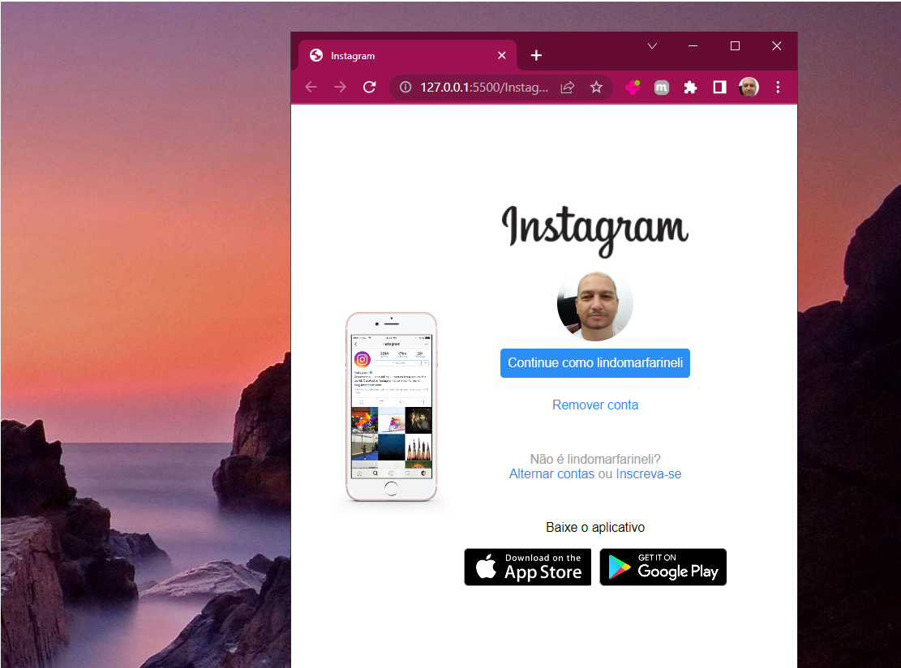
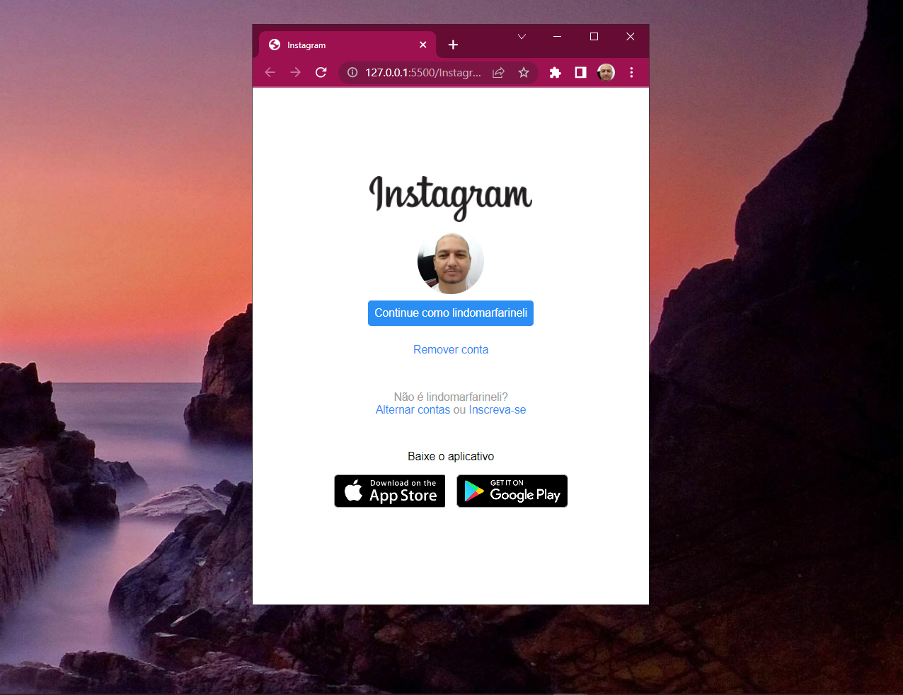

# Recriando a página do Instagram

​	Este arquivo é um pequeno exercício, onde foi recriado a página do Instagram, tem o objetivo de treinar o uso de html e css e envolver este desenvolvedor em alguns desafios.

​	O projeto foi proposto no curso da Digital Innovation One e além do que foi ensinado, houve um tratamento a mais para melhorar a responsividade, diferenciando do projeto original proposto.

​	Abaixo seguem imagens com alguns tamanhos.

​	Nesta primeira imagem quando o tamanho é grande, tela inteira.

 

​	Aqui uma redução de aproximadamente 50% do tamanho de tela. Note que a imagem do celular a direita se tornou menor.

​	E por fim, com redução máxima, semelhante a uma tela de celular, onde a imagem do celular que estava a direita desaparece por completo, já que em uma tela melhor o usuário não quer ficar 'scrollando' e sim digitar apenas o que de fato interessa.

​															                                                                                  		 **Lindomar Farineli**